<div align="center">

# RAMSAD

### *Retrieval Over Training*: Similarity search-based Model Selection for Time Series Anomaly Detection

**Christos Panourgias**<sup>1,\*</sup> · **Roberto Stanzione**<sup>2,\*</sup> · **Adrien Petralia**<sup>1</sup> · **Themis Palpanas**<sup>1</sup> · **Paul Boniol**<sup>2</sup>

<sup>1</sup>Université Paris Cité, LIPADE  <sup>2</sup>École Normale Supérieure, Inria  <sup>\*</sup>Equal contribution

**NeurIPS 2026**

[](pyproject.toml)
[](LICENSE)
[](https://hydra.cc)
[](https://github.com/amazon-science/chronos-forecasting)

</div>

---

**RAMSAD** (**R**etrieval-**A**ugmented **M**odel **S**election for **A**nomaly **D**etection) picks the right time-series anomaly detector for a new series *without training a selector*. It keeps a knowledge base of previously seen series together with how every detector performed on them, retrieves the top-*k* most similar series to the query, and recommends the detector(s) that performed best on those neighbors.

> **The idea in one line:** similar time series tend to favor the same anomaly detector — so model selection becomes a similarity-search problem.

<p align="center">
  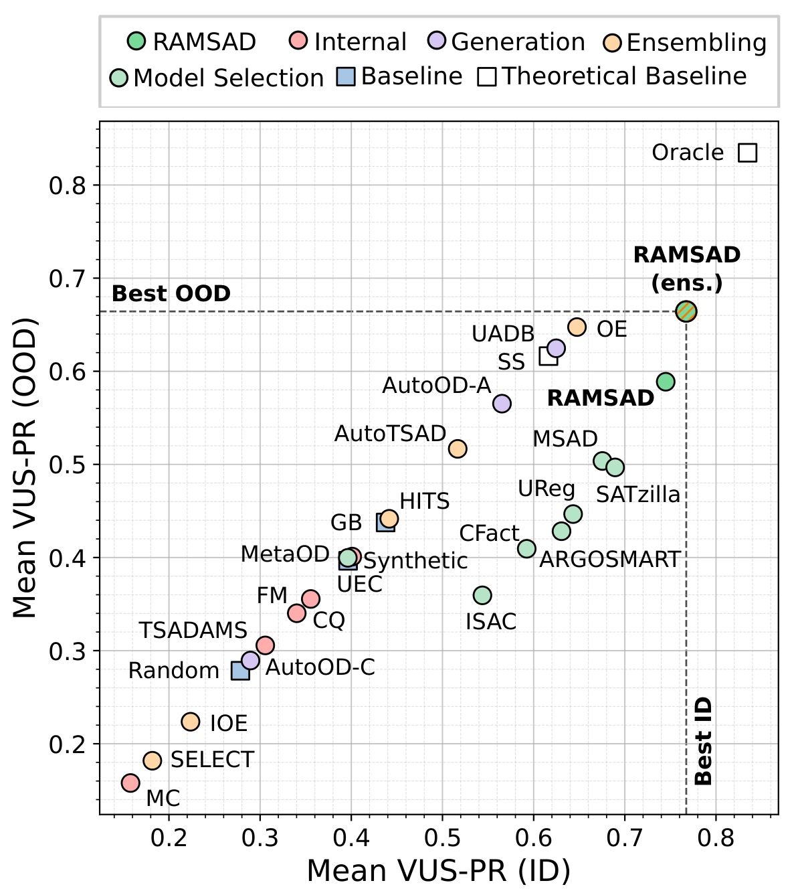
</p>
<p align="center"><em>Mean VUS-PR of RAMSAD against 25 automated TSAD solutions, in-distribution (x-axis) and out-of-distribution (y-axis). RAMSAD (ensemble) is best on both axes.</em></p>

## Contents

- [Highlights](#highlights)
- [Why RAMSAD?](#why-ramsad)
- [How it works](#how-it-works)
- [Results](#results)
- [Explainability](#explainability)
- [Quick start (one-button run)](#quick-start-one-button-run)
- [Install](#install)
- [Step by step](#step-by-step)
- [Ensembles (N > 1)](#ensembles-n--1)
- [Tests](#tests)
- [Repository layout](#repository-layout)

---

## Highlights

- **Training-free selector.** No meta-learner is fitted: detectors are ranked directly from the performance profiles of retrieved neighbors. Adding or removing a detector from the pool only means adding or removing a column of the performance table — no retraining.
- **Best single-detector selector in-distribution.** Average VUS-PR **0.74** on the TSB-AD test split vs. **0.68** for the strongest trained selector (SATZilla); best average rank (6.97 vs. 8.90).
- **Most robust selector out-of-distribution.** Under leave-one-domain-out, RAMSAD drops 17% (to **0.57**) while trained selectors drop 19–20%.
- **Cheap ensembles that beat full-pool ensembles.** Selecting the top-*N* detectors (N=10 of 32) reaches **0.77** VUS-PR in ID and exceeds the best full-pool ensemble (OE) in OOD by 2% while being **×4.7 faster**; not statistically different from the Oracle.
- **Fastest selection.** ~**20 ms** median latency from raw query to recommendation (vs. 39–490 ms for meta-learning selectors), with 0.4 ms std.
- **Pluggable similarity space.** Works on raw series (Euclidean, DTW), frozen TSFM embeddings (e.g. Chronos-2), or TSFM embeddings semantically aligned with dataset descriptions.

## Why RAMSAD?

No single anomaly detector wins across heterogeneous time series, so automated solutions are needed. Existing ones face a trade-off:

<p align="center">
  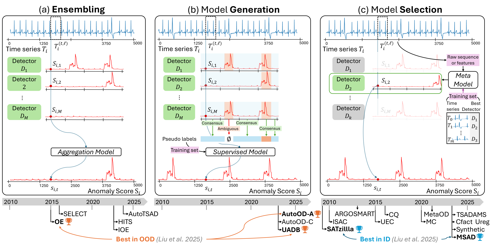
</p>

| Limitation | Affects | How RAMSAD addresses it |
|---|---|---|
| **L1** — must run the whole detector pool (expensive on long series / large pools) | Ensembling, model generation | Runs only the 1 (or *N*) selected detector(s) |
| **L2** — must be retrained when the detector pool changes | Trained selectors (classification / regression) | Non-parametric: just update the performance table |
| **L3** — generalizes poorly under domain shift | Trained selectors | Retrieval in a semantically aligned TSFM space |

## How it works

<p align="center">
  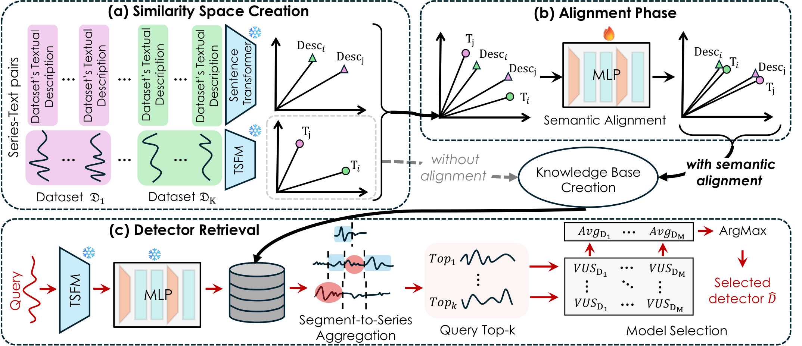
</p>

**(a) Similarity space creation.** Every series in the knowledge base is split into fixed-length segments of size `min(L, 8192)` (8192 = Chronos-2 context). Segments are embedded with a frozen TSFM (Chronos-2); each dataset's textual description is embedded with a frozen sentence transformer (`all-mpnet-base-v2`).

**(b) Alignment phase (optional).** A lightweight MLP projection head per modality is trained with a *symmetric multi-positive contrastive loss*, pulling each time-series segment towards all semantically compatible descriptions (description cosine similarity ≥ γ = 0.95, same-series pairs masked out). This injects a coarse domain prior into the time-series space, which mainly helps OOD. Only the **time-series head** is used afterwards.

**(c) Detector retrieval.** A query is segmented, embedded, and projected the same way. Retrieval is time-series-to-time-series:

<table>
<tr>
<td width="62%">

1. **Segment retrieval** — each of the *m* query segments retrieves its top-*k* nearest knowledge-base segments (cosine similarity).
2. **Segment-to-series aggregation** — for each candidate series $T_j$, average the distances of its retrieved segments, $\mathrm{base}(T_j)$, and measure how consistently it is retrieved, $\mathrm{freq}(T_j)$ = fraction of query segments that hit it. Rank by

   $$\mathrm{score}(T_j) = \frac{\mathrm{base}(T_j)}{\max(\epsilon, \mathrm{freq}(T_j))}$$

   and keep the top-*k* series. This rewards series that match *consistently and closely*, and suppresses isolated matches.
3. **Model selection** — look up the neighbors' rows in the precomputed performance matrix $\mathbf{V}$ (VUS-PR per series × detector), average per detector, and pick

   $$\widehat{D}(T_q) = \arg\max_{D} \frac{1}{k}\sum_{T \in \mathrm{top}_k(T_q)} \mathbf{V}(T, D)$$

   For an ensemble, take the *N* detectors with the highest averages.

</td>
<td width="38%">
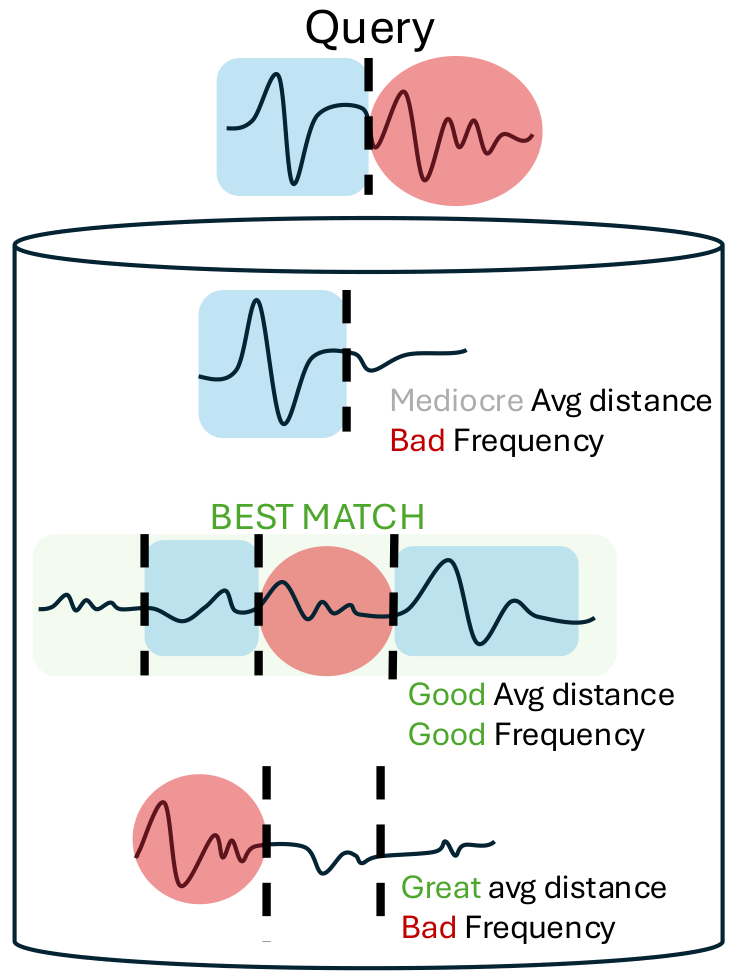
</td>
</tr>
</table>

Because the full performance profile is averaged, a detector is chosen only if it is broadly strong across the neighborhood — neighbors do not have to agree on their individual best detector (see [Explainability](#explainability) for a worked example).

<details>
<summary><b>Semantic alignment details</b></summary>

<p align="center">
  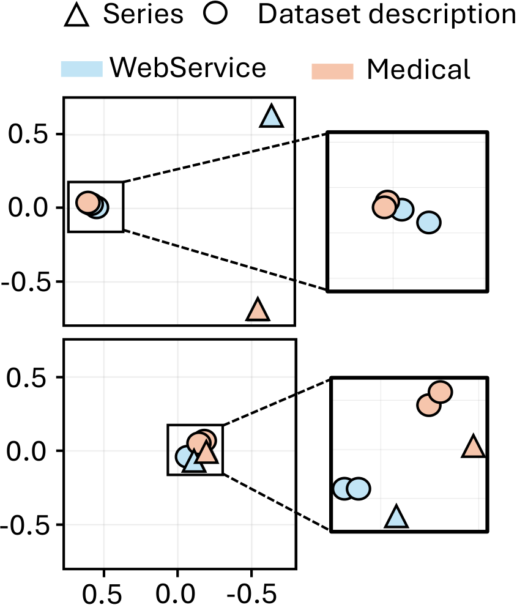
  &nbsp;&nbsp;
  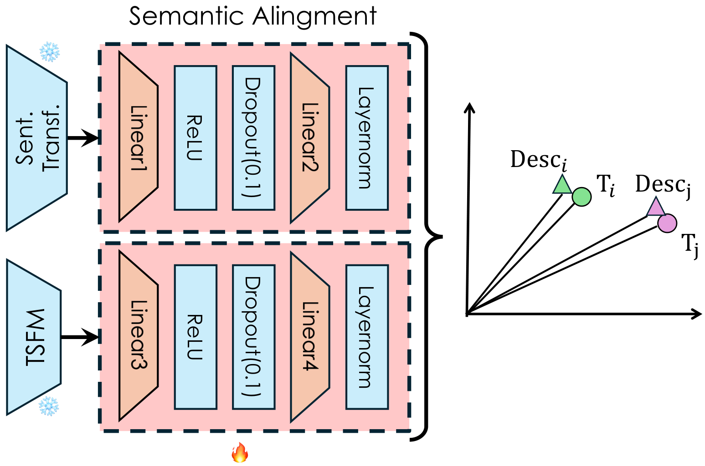
</p>

- Backbones (Chronos-2, `all-mpnet-base-v2`) are **frozen**; only the two MLP projection heads (hidden width = 2× projection dim, ℓ2-normalized outputs) are trained.
- Standard one-positive contrastive learning wrongly treats near-synonymous descriptions (e.g. two different server-monitoring datasets) as negatives. The **multi-positive** target matrix $P$ marks every description with cosine similarity ≥ 0.95 as a positive, and the loss is applied in both directions (segment→description and description→segment).
- Defaults: AdamW, lr 1e-5, weight decay 1e-4, 300 epochs, 10-epoch linear warmup + cosine decay, batch size 8192, temperature 0.1, grad-clip 1.0, 80/20 stratified train/val split.
- In OOD experiments the alignment heads are trained **without** the target domain and applied to it without retraining.

</details>

**Complexity.** With exact search, a batch of *b* query segments against *n* indexed segments of dimension *d* costs $\mathcal{O}(bnd)$; storage is $\mathcal{O}(nd + |\mathfrak{D}|M)$ for the embeddings and the performance matrix.

## Results

**Setup.** [TSB-AD](https://github.com/TheDatumOrg/TSB-AD) univariate benchmark: 870 series from 9 domains, with the train/test split of recent model-selection benchmarks (619 train series → 3,264 knowledge-base segments; 251 test series → 1,383 query segments). Pool of **32 detectors**, compared against **25 automated solutions** (model selection, internal/unsupervised selection, ensembling, model generation, and reference baselines). Metric: **VUS-PR**. OOD = leave-one-domain-out over the 9 domains (target domain removed from the knowledge base *and* from alignment training).

<p align="center">
  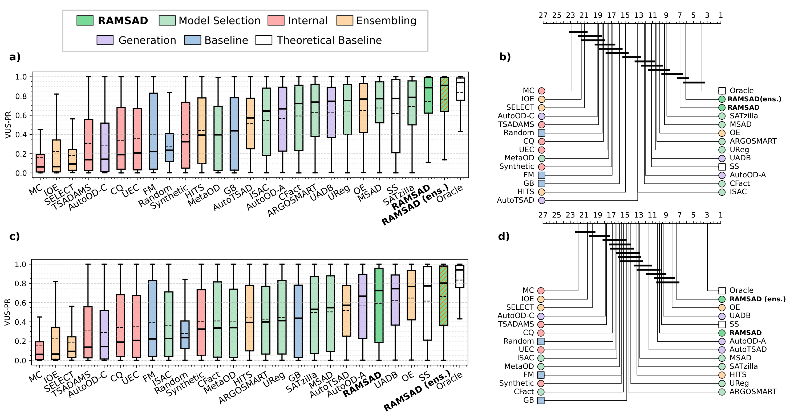
</p>
<p align="center"><em>VUS-PR for in-distribution (a) and out-of-distribution (c), with critical-difference diagrams (b, d).</em></p>

| Setting | RAMSAD (N=1) | RAMSAD ens. (N=10) | Best trained selector (SATZilla) | Best full-pool ensemble (OE) |
|---|---|---|---|---|
| In-distribution | **0.74** | **0.77** | 0.68 | 0.64 |
| Out-of-distribution | 0.57 | **best** (+2% vs OE, ×4.7 faster) | 0.49 | 0.64 |

**Accuracy vs. runtime, and sensitivity to *k* and *N*.** RAMSAD is stable across *k* (max variation ≈0.04 in ID, ≤0.07 in OOD for N=1, shrinking as N grows) and always beats SATZilla.

<p align="center">
  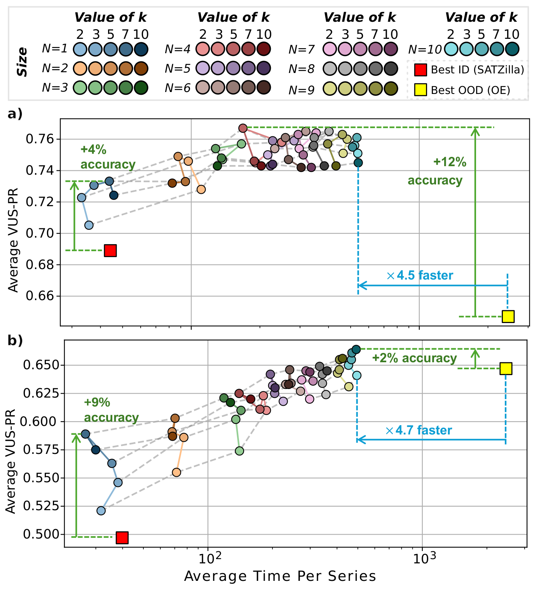
  &nbsp;
  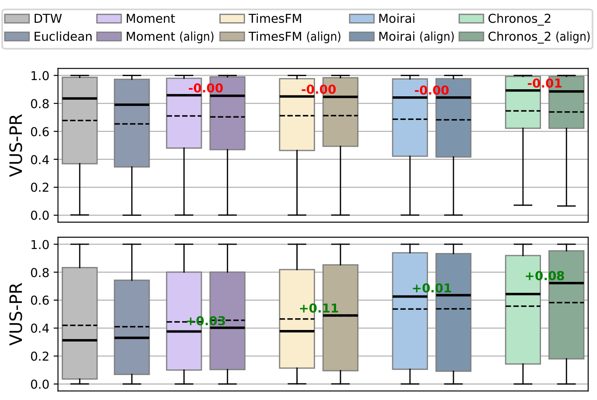
</p>
<p align="center"><em>Left: accuracy vs. detector runtime for different k and ensemble sizes N. Right: raw-space (Euclidean, DTW), TSFM (light) and aligned-TSFM (dark) retrieval spaces.</em></p>

**Similarity spaces.** The best raw-space distance (DTW) reaches 0.69 ID / 0.44 OOD. Plain Chronos-2 embeddings reach 0.75 ID / 0.59 OOD. Semantic alignment is roughly on par in ID and **improves OOD** — it is an OOD-oriented refinement, not a prerequisite.

**Selection latency** (median ms from raw query to recommendation):

| | **RAMSAD** | ARGOSMART | ISAC | MSAD | SATZilla | UReg | MetaOD | CFact |
|---|---|---|---|---|---|---|---|---|
| Features | **19.6** | 37.6 (catch22) | ← | ← | ← | ← | ← | ← |
| Inference | 0.05 | 1.1 | 25.6 | 25.8 | 39.7 | 221.8 | 426.7 | 453.4 |
| **Total** | **19.6** | 38.8 | 63.3 | 63.6 | 77.1 | 258.0 | 463.4 | 489.6 |

**Knowledge-base coverage and detector-pool size.** With only 10% of the knowledge base RAMSAD still beats SATZilla in OOD; in ID it is comparable from 20% and better from 80%. With half the detector pool it matches or beats SATZilla.

<p align="center">
  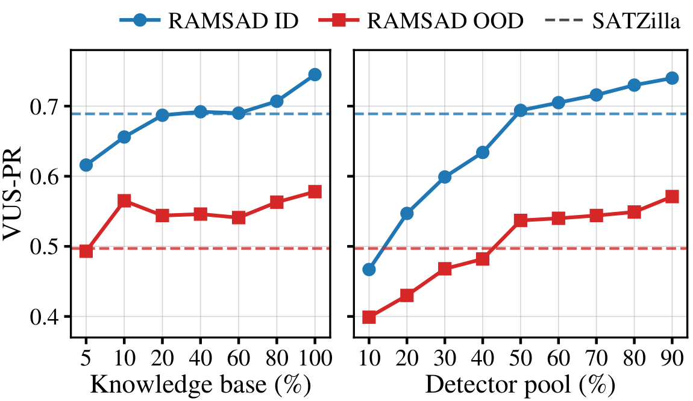
</p>

## Explainability

Every RAMSAD recommendation can be traced back to concrete evidence: the retrieved neighbor series, their datasets, and how every detector performed on them.

**Worked example.** An out-of-distribution query from the *Sensor* domain. Its four nearest neighbors come from the *Medical* and *WebService* domains (aggregation scores 0.3985, 0.4305, 0.4519, 0.4526). Their individual best detectors disagree: two favor `KShapeAD`, the others `MOMENT (FT)` and `CNN`. RAMSAD does not take a majority vote; it averages the full VUS-PR profile of all 32 detectors over the neighbors, and that average peaks at `KShapeAD`, which is selected.

<p align="center">
  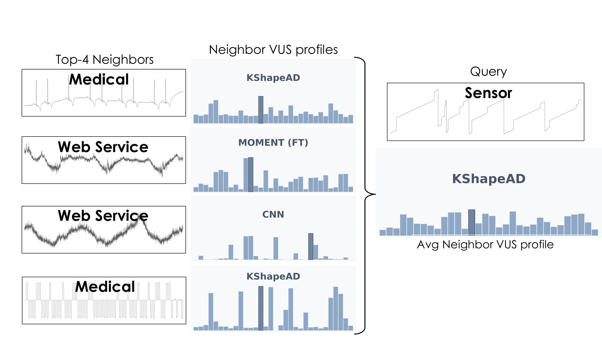
</p>
<p align="center"><em>The query, its top-4 neighbors, each neighbor's VUS-PR over the 32 detectors (hatched bar: its best detector), and the averaged profile, which peaks at KShapeAD.</em></p>

**Natural-language explanations with ChatTS.** Because the evidence is explicit, it can be handed to a time-series language model to write a rationale. [ChatTS](https://github.com/NetManAIOps/ChatTS) receives (i) the query series, (ii) the retrieved neighbors, (iii) the dataset descriptions of the query and neighbors, (iv) the retrieval metadata (rank and aggregation score), (v) each neighbor's best detector and its VUS-PR, and (vi) a short description of the selected detector. It returns a concise explanation. This step is purely explanatory: it does not change RAMSAD's prediction.

<p align="center">
  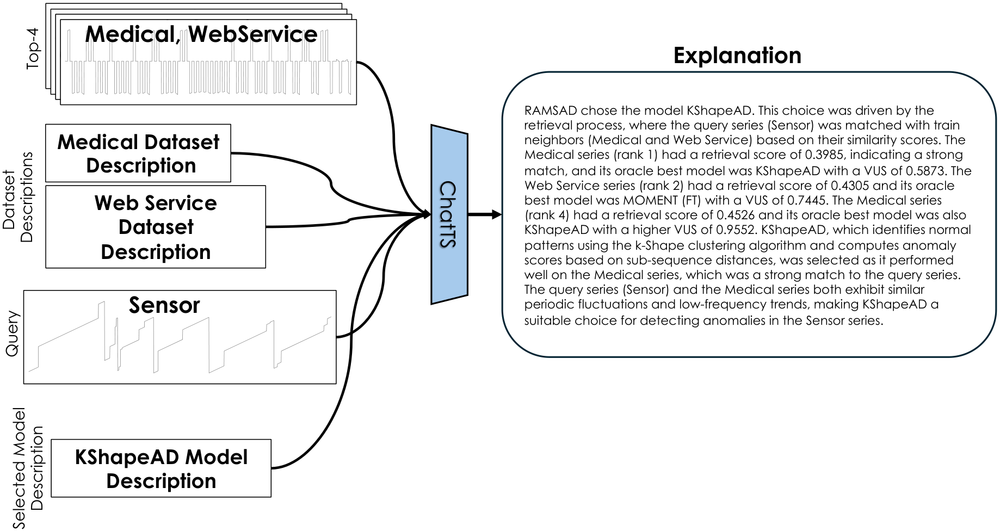
</p>
<p align="center"><em>ChatTS explanation for the example above.</em></p>

In this example, ChatTS explains that `KShapeAD` is chosen because it has the strongest average VUS-PR over the neighbors, especially on the *Medical* series, which are the closest matches to the query and share its periodic structure. The explanation also links this to how the detector works: it models normal patterns with k-Shape clustering and scores deviations from them.

---

## Quick start (one-button run)

Reproduce the paper's single-detector results with one command per setting:

```bash
git clone https://github.com/Hendrix8/RAMSAD.git && cd RAMSAD

# In-distribution: knowledge base = 619 TSB-AD train series, queries = 251 test series
bash scripts/run_full_pipeline_id_k1_k10.sh

# Out-of-distribution: each of the 9 domains is held out in turn
bash scripts/run_full_pipeline_ood_k1_k10.sh
```

Each script creates a `.venv`, installs RAMSAD, builds the segments, embeds them, trains the alignment heads, retrieves neighbours and selects detectors for every *k* from 1 to 10. It ends by printing the mean VUS-PR per *k*; the detector chosen for each series is in `outputs/full_pipeline_*/eval_k/k*/model_selection_k*.csv`. On two Quadro RTX 6000 GPUs the ID run takes about 10 minutes and the OOD run about 45.

- **GPU:** prefix the command with `INSTALL_CUDA124=1` to install PyTorch with CUDA 12.4.
- **One OOD domain:** `RAMSAD_OOD_DOMAIN=medical bash scripts/run_full_pipeline_ood_k1_k10.sh`. Domains: `environment`, `facility`, `finance`, `humanactivity`, `medical`, `sensor`, `synthetic`, `traffic`, `webservice`.
- **Re-runs:** segments that already exist are reused. The script headers list `SKIP_*` switches for the other steps.

## Install

To use RAMSAD step by step instead of through the scripts:

```bash
python -m venv .venv && source .venv/bin/activate
pip install -e ".[dev]"
```

For a GPU, add the PyTorch index for your CUDA version ([pick it here](https://pytorch.org/get-started/locally/)), e.g. `pip install -e ".[dev,cuda124]" --extra-index-url https://download.pytorch.org/whl/cu124`.

| Extra | Needed for |
|---|---|
| `[dev]` | tests, description embeddings |
| `[alignment]` | training the alignment heads |
| `[ensemble]` | scoring ensembles ([TSB-AD](https://github.com/TheDatumOrg/TSB-AD) detectors and VUS-PR) |

## Step by step

The data RAMSAD needs ships in `data/raw/`: the raw TSB-AD series (`Train/`, `Test/`), the VUS-PR of every detector on every series (`VUS/train.csv`, `VUS/test.csv`) and a text description per source dataset (`descriptions.csv`).

```bash
export RAMSAD_DATA_ROOT=$PWD/data/processed_data   # where generated files go

# 1. Cut every series into segments (once)
generate_segments --id --train-csv data/raw/VUS/train.csv --test-csv data/raw/VUS/test.csv \
    --data-root "$RAMSAD_DATA_ROOT" --raw-root "$PWD/data/raw" --descriptions-csv data/raw/descriptions.csv

# 2. Embed with Chronos-2, retrieve the nearest series, select the detector
ramsad-pipeline experiment=paper_id_single
```

The result is `model_selection.csv` in the run folder (`outputs/<date>/<time>/`, printed in the log): one row per query series with the chosen detector (`selected_model`) and the top-*N* list (`selected_models`).

For OOD, build the leave-one-domain-out splits with `generate_segments --ood --domains auto` (same other arguments), then run `ramsad-pipeline experiment=paper_ood_single data.ood_domain=medical`.

Settings are changed on the command line as `key=value`:

| Setting | Default | What it does |
|---|---|---|
| `select.k` | `6` | number of retrieved neighbours whose detector scores are averaged (at most `retrieve.top_k`, 10) |
| `select.n` | `1` | number of detectors to return; `N > 1` selects an ensemble (see below) |
| `retrieve.mode` | `chronos` | `chronos` = plain Chronos-2 embeddings; `alignment` = aligned embeddings (train them first, below) |
| `data.ood_domain` | `sensor` | held-out domain for OOD runs |
| `pipeline.skip_embed` | `false` | reuse embeddings already stored in the segment files |

The stages can also be run one at a time: `ramsad-embed`, `ramsad-retrieve`, `ramsad-select`.

<details>
<summary><b>Aligned similarity space (optional, mainly helps OOD)</b></summary>

```bash
pip install -e ".[alignment]"
ramsad-embed-desc data=id                                   # embed the dataset descriptions (MPNet)
ramsad-embed experiment=paper_id_single                     # embed the series (Chronos-2)
ramsad-train-alignment data.desc_emb_col=all-mpnet-base-v2_desc
ramsad-pipeline experiment=paper_id_single pipeline.skip_embed=true retrieve.mode=alignment
```

Training writes to `outputs/alignment/run-*`; retrieval uses the newest run unless you pass `retrieve.alignment_run_dir=<run folder>`. Training settings live in `alignment/config/` (e.g. `ramsad-train-alignment training.batch_size=256`).

</details>

## Ensembles (N > 1)

RAMSAD can recommend several detectors instead of one. Ensemble scoring is the average of the selected detectors' anomaly scores, each min-max normalised to [0, 1]; this is the "RAMSAD (ens.)" setting in the paper.

```bash
pip install -e ".[ensemble]"

# 1. Select the top-10 detectors for each series
ramsad-pipeline experiment=paper_id_single select.n=10

# 2. Run them and combine their scores
ramsad-ensemble ensemble.selection_csv=outputs/<date>/<time>/model_selection.csv \
    ensemble.scores_dir=data/scores ensemble.run_missing=true
```

`ramsad-ensemble` looks for each detector's scores in `<scores_dir>/<Detector>/<series>.npy` (TSB-AD names, e.g. `Sub_PCA`, `MOMENT_FT`), so a folder of TSB-AD benchmark scores works as is. With `ensemble.run_missing=true` a missing score is computed with TSB-AD's tuned hyperparameters and saved there for next time. The run folder gets `ensemble_results.csv` (detectors used and VUS-PR per series) and the ensemble scores in `ensemble_scores/`. For unlabeled series, add `ensemble.evaluate=false`.

To combine scores you already have:

```python
from ramsad.ensemble import combine_scores
ensemble_score = combine_scores([score_a, score_b, score_c])
```

## Tests

```bash
pytest -q
```

## Repository layout

```
.
├── src/ramsad/          # library + run_*.py Hydra entrypoints
│   ├── embed.py             # Chronos-2 segment embeddings
│   ├── embed_desc.py        # MPNet description embeddings
│   ├── retrieve.py          # segment retrieval + segment-to-series aggregation
│   ├── select.py            # mean-VUS argmax model selection
│   ├── ensemble.py          # score top-N ensembles (min-max + mean), VUS-PR
│   ├── alignment_projector.py
│   ├── generate_segments.py
│   └── conf/                # Hydra configs
├── alignment/           # Chronos↔description alignment trainer
├── scripts/             # one-command drivers and k-sweep evaluation
├── data/raw/            # performance tables (VUS/), raw series (Train/, Test/), descriptions.csv
├── tests/
└── assets/              # README figures (from the paper)
```

## Acknowledgements

Supported by DataGEMS (101188416). This work was granted access to the HPC resources of IDRIS under the allocation 2025-A0191012641 made by GENCI. The benchmark data and detector pool come from [TSB-AD](https://github.com/TheDatumOrg/TSB-AD); time-series embeddings use [Chronos-2](https://github.com/amazon-science/chronos-forecasting).

## License

[MIT](LICENSE)
